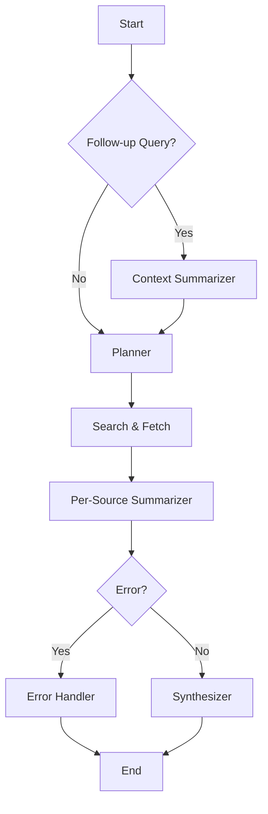

# Context-Aware Research Brief Generator

A production-grade research assistant system that generates structured, evidence-linked research briefs using LangGraph and LangChain with Azure OpenAI. The system supports follow-up queries by summarizing prior user interactions and incorporating this context into subsequent outputs.

## 🎨 Frontend

A modern Next.js frontend with Tailwind CSS provides a professional interface for:
- **📊 Dashboard**: Real-time metrics and activity visualization
- **💬 Chat**: Interactive conversation with the research assistant
- **📋 Brief Generator**: Easy-to-use form for generating research briefs
- **📊 History**: View and manage previous research briefs
- **⚙️ Settings**: Configure backend connection and system settings

### Quick Frontend Start

```bash
# Start both backend and frontend
python start_app.py

# Or start frontend only (if backend is already running)
cd frontend
npm run dev
```

The frontend will be available at: **http://localhost:3000**

## 🎯 Problem Statement and Objective

Traditional research tools often lack context awareness and produce isolated results. This system addresses this by:

- **Context-Aware Processing**: Maintains user research history and incorporates it into new queries
- **Structured Outputs**: All outputs follow strict schemas with validation
- **Modular Architecture**: Uses LangGraph for orchestration with distinct processing nodes
- **Production Ready**: Includes API, CLI, testing, monitoring, and deployment capabilities
- **Azure OpenAI Integration**: Uses the latest LangChain v0.3+ with Azure OpenAI API
- **Simple Storage**: Uses SQLite for data persistence without external dependencies

## 🏗️ Architecture

### LangGraph Structure

The system uses a LangGraph with the following nodes:



### Core Components

1. **Context Summarizer**: Processes user history for follow-up queries
2. **Planner**: Creates structured research plans with search queries
3. **Search & Fetch**: Executes searches and retrieves content
4. **Per-Source Summarizer**: Summarizes individual sources
5. **Synthesizer**: Combines all sources into final brief
6. **Error Handler**: Manages errors gracefully

## 🎨 Frontend Features

### Next.js Interface

The frontend provides a modern, responsive interface with the following features:

#### 📊 Dashboard
- **Real-time Metrics**: Total briefs, execution times, sources used, cost estimates
- **Activity Timeline**: Visual timeline of recent research topics
- **Backend Status**: Live connection status with the backend
- **Interactive Charts**: Plotly-powered visualizations

#### 💬 Chat Interface
- **Interactive Chat**: Natural conversation with the research assistant
- **Context Awareness**: Remembers previous conversations
- **Quick Brief Generation**: Seamless transition from chat to brief generation
- **Message History**: Persistent chat history during session

#### 📋 Brief Generator
- **Rich Text Input**: Detailed topic input with placeholders
- **Depth Selection**: Shallow (3-5 sources), moderate (5-8 sources), deep (8-12 sources)
- **Follow-up Queries**: Mark requests as follow-ups for context-aware processing
- **Additional Context**: Optional specific requirements or focus areas
- **Real-time Progress**: Live updates during brief generation

#### 📊 History & Analytics
- **Research History**: View all previously generated briefs
- **Detailed Analytics**: Execution times, token usage, source counts
- **Export Functionality**: Download briefs as JSON files
- **Search and Filter**: Find specific briefs quickly

#### ⚙️ Settings
- **Backend Configuration**: Configure backend URL and connection
- **System Information**: View available models and system status
- **Data Management**: Clear chat and brief history
- **User Preferences**: Customize the interface

### UI/UX Design

- **Modern Design**: Clean, professional interface with Tailwind CSS
- **Responsive Layout**: Optimized for desktop and mobile devices
- **Interactive Elements**: Hover effects, smooth transitions, intuitive navigation
- **Color-coded Metrics**: Visual indicators for different data types
- **Professional Components**: Heroicons, consistent spacing, and modern typography

## 🤖 Model and Tool Selection

### LLM Strategy

- **Azure OpenAI GPT-4o**: Used for all reasoning tasks including planning, summarization, and synthesis
- **Single Model Approach**: Uses the same Azure OpenAI deployment for all tasks with different configurations

### Tools

- **Tavily Search**: Web search for content discovery
- **BeautifulSoup4**: Web scraping for content extraction
- **LangSmith**: Observability and tracing
- **SQLite**: Local data storage for user history and briefs

## 📊 Schema Definitions

### Core Schemas

```python
class ResearchPlan(BaseModel):
    queries: List[str]  # Search queries
    rationale: str      # Planning rationale
    expected_sources: int
    focus_areas: List[str]

class SourceSummary(BaseModel):
    url: HttpUrl
    title: str
    summary: str
    relevance_score: float
    key_points: List[str]
    source_type: str

class FinalBrief(BaseModel):
    topic: str
    executive_summary: str
    synthesis: str
    key_insights: List[str]
    references: List[SourceSummary]
    context_used: Optional[ContextSummary]
```

## 🚀 Quick Start

### Prerequisites

- Python 3.11+
- Azure OpenAI API access
- Tavily API key

### Complete Setup (Backend + Frontend)

1. **Clone and setup**:
   ```bash
   git clone <repository-url>
   cd Context-Aware-Research-Brief-Generator
   ```

2. **Install dependencies**:
   ```bash
   # Backend dependencies
   cd backend
   pip install -r requirements.txt
   
   # Frontend dependencies
   cd ../frontend
   npm install
   ```

3. **Configure environment**:
   ```bash
   cd ../backend
   cp env.example .env
   # Edit .env with your Azure OpenAI credentials
   ```

4. **Start the complete application**:
   ```bash
   # From the root directory
   python start_app.py
   ```

5. **Access the application**:
   - **Frontend**: http://localhost:3000
   - **Backend API**: http://localhost:8000
   - **API Docs**: http://localhost:8000/docs

### Installation

1. **Clone the repository**:
   ```bash
   git clone <repository-url>
   cd backend
   ```

2. **Install dependencies**:
   ```bash
   pip install -r requirements.txt
   ```

3. **Set up environment variables**:
   ```bash
   cp env.example .env
   # Edit .env with your Azure OpenAI credentials
   ```

4. **Run tests**:
   ```bash
   pytest
   ```

### Environment Variables

```bash
# Azure OpenAI Configuration
AZURE_OPENAI_API_KEY=your-azure-openai-api-key
AZURE_OPENAI_ENDPOINT=https://your-resource.openai.azure.com/
AZURE_OPENAI_API_VERSION=2024-02-15-preview
AZURE_OPENAI_LLM_DEPLOYMENT_NAME=your-deployment-name

# Search Tool
TAVILY_API_KEY=tvly-...

# Database (SQLite)
DATABASE_URL=sqlite:///./research_assistant.db

# Optional
LANGCHAIN_TRACING_V2=true
LANGCHAIN_API_KEY=ls_...
```

### Usage

#### CLI Interface

```bash
# Generate a research brief
python -m app.cli generate --topic "artificial intelligence trends 2024"

# Generate with follow-up context
python -m app.cli generate --topic "AI ethics" --follow-up

# View user history
python -m app.cli history --user-id "user123"

# Check system status
python -m app.cli test
```

#### API Interface

```bash
# Start the API server
uvicorn app.main:app --reload

# Generate a brief via API
curl -X POST "http://localhost:8000/brief" \
  -H "Content-Type: application/json" \
  -d '{
    "topic": "artificial intelligence trends 2024",
    "depth": "moderate",
    "follow_up": false,
    "user_id": "user123"
  }'

#### Docker Deployment

```bash
# Build and run with Docker Compose
docker-compose up --build

# Or build and run manually
docker build -t research-brief .
docker run -p 8000:8000 --env-file .env research-brief
```

## 📋 API Reference

### POST /brief

Generate a research brief using Azure OpenAI.

**Request Body**:
```json
{
  "topic": "string",
  "depth": "shallow|moderate|deep",
  "follow_up": boolean,
  "user_id": "string",
  "additional_context": "string (optional)"
}
```

**Response**:
```json
{
  "brief": {
    "topic": "string",
    "executive_summary": "string",
    "synthesis": "string",
    "key_insights": ["string"],
    "references": [...],
    "generated_at": "datetime"
  },
  "execution_time": float,
  "trace_url": "string (optional)"
}
```

### GET /user/{user_id}/history

Get user's research history.

### GET /user/{user_id}/stats

Get user statistics.

### GET /health

Health check endpoint.

### GET /models

Get information about available models (Azure OpenAI).

## 🧪 Testing

### Run Tests

```bash
# Run all tests
pytest

# Run with coverage
pytest --cov=app

# Run specific test file
pytest tests/test_schemas.py
```

### Test Structure

- **Unit Tests**: Test individual schemas and functions
- **Integration Tests**: Test graph execution with mocked LLMs
- **End-to-End Tests**: Test complete workflows

## 📈 Monitoring and Observability

### LangSmith Integration

The system integrates with LangSmith for comprehensive tracing and monitoring:

#### Setup

1. **Environment Configuration**:
   ```bash
   # Add to your .env file
   LANGCHAIN_TRACING_V2=true
   LANGCHAIN_API_KEY=ls_...  # Your LangSmith API key
   LANGCHAIN_PROJECT=Research Assistant
   LANGCHAIN_ENDPOINT=https://api.smith.langchain.com
   ```

2. **Verify Setup**:
   ```bash
   # Check monitoring status via CLI
   python -m app.cli monitoring
   
   # Or via API
   curl http://localhost:8000/monitoring/status
   ```

#### Features

- **Trace URLs**: Direct links to LangSmith traces for each execution
- **Token Usage Tracking**: Real-time token consumption per operation
- **Cost Estimation**: Azure OpenAI pricing estimates
- **Execution Metrics**: Node-by-node performance tracking
- **Error Monitoring**: Detailed error tracking and reporting

#### API Endpoints

```bash
# Get monitoring status
GET /monitoring/status

# Get execution metrics for a trace
GET /monitoring/metrics/{trace_id}

# Get configuration with monitoring info
GET /config
```

#### CLI Commands

```bash
# Show monitoring status
python -m app.cli monitoring

# Show configuration including monitoring
python -m app.cli config
```

#### Example Response with Monitoring

```json
{
  "brief": {
    "topic": "artificial intelligence trends 2024",
    "executive_summary": "...",
    "synthesis": "...",
    "key_insights": [...],
    "references": [...],
    "generated_at": "2024-01-15T10:30:00Z"
  },
  "execution_time": 45.2,
  "trace_url": "https://smith.langchain.com/o/Research%20Assistant/r/abc123",
  "token_usage": {
    "total_tokens": 12500,
    "total_cost_estimate": 0.1875,
    "operations": [
      {
        "operation": "llm_call",
        "model": "gpt-4o",
        "prompt_tokens": 8000,
        "completion_tokens": 4500,
        "total_tokens": 12500
      }
    ]
  }
}
```

### Metrics Dashboard

The system provides comprehensive metrics:

- **Performance Metrics**: Execution time per node, total duration
- **Resource Usage**: Token consumption, cost estimates
- **Quality Metrics**: Error rates, success rates
- **User Analytics**: Research patterns, topic preferences

### Logging

Structured logging with different levels:

```bash
# Set log level
export LOG_LEVEL=INFO  # DEBUG, INFO, WARNING, ERROR

# View logs
docker logs research-brief-api
```

## 🚀 Deployment

### Production Deployment

1. **Environment Setup**:
   ```bash
   export ENVIRONMENT=production
   export DATABASE_URL=sqlite:///./research_assistant.db
   ```

2. **Deploy with Docker**:
   ```bash
   docker build -t research-brief .
   docker run -d -p 8000:8000 --env-file .env research-brief
   ```

### Cloud Deployment

#### Azure App Service

```bash
# Deploy to Azure App Service
az webapp up --name research-brief --resource-group your-rg --runtime "PYTHON:3.11"
```

#### Railway

```bash
# Install Railway CLI
npm install -g @railway/cli

# Deploy
railway login
railway init
railway up
```

#### Heroku

```bash
# Create Heroku app
heroku create research-brief-app

# Set environment variables
heroku config:set AZURE_OPENAI_API_KEY=your-key
heroku config:set AZURE_OPENAI_ENDPOINT=your-endpoint
heroku config:set TAVILY_API_KEY=your-key

# Deploy
git push heroku main
```

## 📊 Performance Benchmarks

### Latency

- **Planning**: ~2-3 seconds
- **Search & Fetch**: ~5-10 seconds (depends on sources)
- **Summarization**: ~3-5 seconds per source
- **Synthesis**: ~3-5 seconds
- **Total**: ~15-25 seconds for moderate depth

### Token Usage

- **Planning**: ~500-1000 tokens
- **Per-source summarization**: ~300-500 tokens per source
- **Synthesis**: ~1000-2000 tokens
- **Total**: ~3000-5000 tokens per brief

### Cost Estimation

- **Azure OpenAI GPT-4o**: ~$0.02-0.04 per brief
- **Tavily Search**: ~$0.01-0.02 per brief
- **Total**: ~$0.04-0.07 per brief

## 🔧 Configuration

### Environment Variables

```bash
# Required
AZURE_OPENAI_API_KEY=your-azure-openai-api-key
AZURE_OPENAI_ENDPOINT=https://your-resource.openai.azure.com/
AZURE_OPENAI_LLM_DEPLOYMENT_NAME=your-deployment-name
TAVILY_API_KEY=tvly-...

# Optional
LANGCHAIN_TRACING_V2=true
LANGCHAIN_API_KEY=ls_...
LANGCHAIN_PROJECT=Research Assistant
DATABASE_URL=sqlite:///./research_assistant.db
LOG_LEVEL=INFO
ENVIRONMENT=development
```

### Research Settings

```bash
MAX_SOURCES_PER_QUERY=5
MAX_CONTENT_LENGTH=10000
REQUEST_TIMEOUT=30
PRIMARY_MODEL=gpt-4o
SECONDARY_MODEL=gpt-4o
```

## 🚨 Limitations and Areas for Improvement

### Current Limitations

1. **Rate Limits**: Azure OpenAI API rate limits may affect performance
2. **Content Quality**: Web scraping depends on source quality
3. **Context Window**: Limited by LLM context windows
4. **Cost**: API costs scale with usage
5. **Storage**: SQLite is single-file and not suitable for high concurrency

### Future Improvements

1. **Caching**: Implement in-memory caching for repeated queries
2. **Vector Search**: Add semantic search capabilities
3. **Multi-modal**: Support for images and documents
4. **Real-time**: WebSocket support for streaming results
5. **Advanced Analytics**: User behavior analysis
6. **Custom Models**: Fine-tuned models for specific domains
7. **Database**: Migrate to PostgreSQL for production scale

## 🤝 Contributing

1. Fork the repository
2. Create a feature branch
3. Make your changes
4. Add tests
5. Submit a pull request

## 📄 License

MIT License - see LICENSE file for details.

## 📞 Support

For issues and questions:
- Create an issue on GitHub
- Check the documentation
- Review the test examples

---

**Built with ❤️ using LangGraph, LangChain v0.3+, and Azure OpenAI**